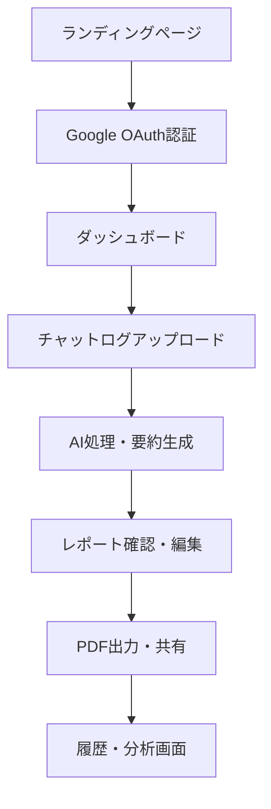

# ChatReport - Project Requirements Document (PRD)

## 📋 プロジェクト概要

### プロダクト名
**ChatReport** - AI-Powered Chat Analytics & Reporting Platform

### ミッション
「チャットコミュニケーションを価値ある洞察に変換し、チームの生産性向上を支援する」

### ターゲットユーザー
- **プライマリ**: 中小企業の営業チーム（10-100名規模）
- **セカンダリ**: リモートワーカー、プロジェクトマネージャー
- **ペルソナ**: 営業マネージャー（35-45歳）、情報整理・報告業務に課題

### 価値提案
1. **効率化**: チャット要約作業を90%削減
2. **洞察**: AIによる会話分析で隠れた課題を発見
3. **標準化**: 統一されたレポートフォーマットで情報共有
4. **セキュリティ**: 企業データの安全な処理・保管

### ビジネス目標
- **Year 1**: 500社導入、月額収益500万円
- **Year 2**: 2,000社導入、月額収益2,000万円
- **市場**: 日本のSaaS市場（1.2兆円）の0.01%獲得

## 🛠️ 技術スタック

### フロントエンド
```yaml
Framework: Next.js 14+ (App Router)
Language: TypeScript
Styling: Tailwind CSS + shadcn/ui
State Management: Zustand
Data Fetching: TanStack Query (React Query)
Charts: Chart.js / Recharts
PDF Generation: React-PDF
Build Tool: Turbopack
```

### バックエンド
```yaml
Framework: Python FastAPI 0.104+
Language: Python 3.11+
Database: PostgreSQL 15+
ORM: SQLAlchemy 2.0+ (async)
Cache: Redis 7+
Message Queue: Celery + Redis
AI Integration: OpenAI GPT-4 Turbo API
PDF Generation: ReportLab
Background Tasks: Celery Worker
```

### インフラストラクチャ
```yaml
Hosting: 
  - Frontend: Vercel
  - Backend: AWS ECS / Railway
  - Database: AWS RDS / Railway PostgreSQL
Authentication: Google OAuth 2.0 + JWT
File Storage: AWS S3 / Cloudflare R2
CDN: CloudFlare
Monitoring: Sentry + DataDog
CI/CD: GitHub Actions
```

### AI・データ処理
```yaml
Primary AI: OpenAI GPT-4 Turbo
Backup AI: Anthropic Claude 3
Text Processing: spaCy, NLTK
Document Processing: python-docx, PyPDF2
Data Analysis: pandas, numpy
```

## 🔄 ユーザーフロー

### 1. 基本フロー


### 2. 詳細ユーザージャーニー

#### 新規ユーザー（初回利用）
1. **発見・認知**: Webサイト訪問
2. **興味・関心**: 機能説明・デモ動画視聴
3. **トライアル**: Google認証でアカウント作成
4. **オンボーディング**: チュートリアル（3ステップ）
5. **初回利用**: サンプルチャットで要約体験
6. **価値実感**: 生成されたレポートの品質確認
7. **継続利用**: 実際の業務データでの利用開始

#### 既存ユーザー（日常利用）
1. **ログイン**: ダッシュボードアクセス
2. **データ投入**: チャットログアップロード/API連携
3. **処理実行**: AI要約・分析の実行
4. **結果確認**: 生成されたレポートの確認・編集
5. **出力・共有**: PDF出力、チーム共有
6. **分析活用**: 過去データとの比較・トレンド分析

## ⚙️ コア機能一覧

### 1. チャット処理機能
```yaml
ファイルアップロード:
  - 対応形式: CSV, JSON, TXT, ZIP
  - 最大サイズ: 50MB
  - 文字エンコーディング: UTF-8, Shift_JIS
  - バッチ処理対応: 最大10ファイル同時

チャットパース:
  - プラットフォーム対応: Slack, Teams, Discord, LINE WORKS
  - メタデータ抽出: 参加者、タイムスタンプ、リアクション
  - データクリーニング: ノイズ除去、重複削除
```

### 2. AI要約・分析機能
```yaml
要約生成:
  - 長文要約: GPT-4 Turboによる高精度要約
  - 要約レベル: 詳細/標準/簡潔の3段階
  - 多言語対応: 日本語、英語
  - リアルタイム処理: 5,000文字/秒

分析機能:
  - 参加者別発言分析
  - 感情分析（ポジティブ/ネガティブ/ニュートラル）
  - キーワード抽出・頻度分析
  - トピック分類（営業、技術、管理等）
  - 時系列分析（発言量推移）
```

### 3. レポート生成機能
```yaml
レポートテンプレート:
  - 営業会議レポート
  - プロジェクト進捗レポート
  - 顧客面談レポート
  - チーム振り返りレポート
  - カスタムテンプレート

出力機能:
  - PDF生成: 高品質レイアウト
  - Excel出力: データ分析用
  - PowerPoint出力: プレゼン用
  - Web共有: URLリンク生成
```

### 4. ダッシュボード・分析機能
```yaml
メインダッシュボード:
  - 処理済みチャット数
  - 今月の要約生成数
  - 人気のテンプレート
  - 最近の活動履歴

分析ダッシュボード:
  - チーム別活動量
  - 時間帯別発言分布
  - 感情分析トレンド
  - キーワードクラウド
  - パフォーマンス指標
```

## 🎨 UI詳細（画面構成と導線）

### 1. レイアウト構成
```yaml
共通レイアウト:
  Header: ロゴ、ナビゲーション、ユーザーメニュー
  Sidebar: メインナビゲーション（ダッシュボード、アップロード、履歴、設定）
  Main Content: 各画面のメインコンテンツ
  Footer: コピーライト、ヘルプリンク
```

### 2. 主要画面設計

#### A. ランディングページ
```yaml
構成:
  - Hero Section: キャッチコピー、価値提案、CTA
  - Feature Section: 主要機能3つ（アップロード、AI要約、レポート出力）
  - Demo Section: 実際の要約例のビフォーアフター
  - Pricing Section: 料金プラン比較
  - Testimonial Section: 顧客の声
  - CTA Section: 無料トライアル誘導

デザイン:
  - カラー: プライマリー#2563eb、セカンダリー#64748b
  - フォント: Inter（英語）、Noto Sans JP（日本語）
  - アニメーション: Framer Motion使用
```

#### B. ダッシュボード
```yaml
レイアウト:
  - 上部: KPIカード4つ（処理数、要約数、保存容量、API使用量）
  - 左上: クイックアクション（新規アップロード、テンプレート選択）
  - 右上: 最近の活動（直近5件）
  - 下部: グラフ・チャート（使用量推移、人気機能）

インタラクション:
  - ホバーエフェクト: カード、ボタンに微細なアニメーション
  - ローディング: スケルトンUI使用
  - レスポンシブ: モバイルでは1カラムレイアウト
```

#### C. アップロード画面
```yaml
UI要素:
  - ドラッグ&ドロップエリア: 点線枠、アイコン表示
  - ファイル選択ボタン: 代替手段として提供
  - プレビューエリア: アップロード済みファイル一覧
  - 設定パネル: 要約レベル、言語設定、テンプレート選択
  - 実行ボタン: 大きく目立つプライマリボタン

フィードバック:
  - 成功: 緑色のチェックマーク、成功メッセージ
  - エラー: 赤色の警告アイコン、具体的なエラー内容
  - 進行中: プログレスバー、推定完了時間表示
```

#### D. レポート表示・編集画面
```yaml
レイアウト:
  - 左パネル: レポート構成要素（サマリー、詳細、チャート）
  - 中央: メインコンテンツ表示・編集エリア
  - 右パネル: 設定・カスタマイズオプション

編集機能:
  - インライン編集: クリックで編集モード
  - ドラッグ&ドロップ: セクション並び替え
  - リアルタイムプレビュー: 変更即座に反映
  - 保存状態表示: 自動保存ステータス
```

### 3. レスポンシブ対応
```yaml
Breakpoints:
  - Mobile: ~768px（1カラム、スタックレイアウト）
  - Tablet: 768px~1024px（2カラム、一部機能簡略化）
  - Desktop: 1024px~（フル機能、3カラムレイアウト）

モバイル最適化:
  - タッチ操作: 44px以上のタップターゲット
  - ナビゲーション: ハンバーガーメニュー
  - フォーム: 大きな入力欄、明確なラベル
  - テーブル: 横スクロール、カード形式への変換
```

## 🔧 バックエンド構成

### 1. データベーススキーマ
```sql
-- ユーザー管理
CREATE TABLE users (
    id UUID PRIMARY KEY DEFAULT gen_random_uuid(),
    email VARCHAR(255) UNIQUE NOT NULL,
    name VARCHAR(100) NOT NULL,
    company VARCHAR(100),
    plan_type VARCHAR(20) DEFAULT 'free',
    google_id VARCHAR(100) UNIQUE,
    avatar_url TEXT,
    created_at TIMESTAMP DEFAULT NOW(),
    updated_at TIMESTAMP DEFAULT NOW()
);

-- サブスクリプション
CREATE TABLE subscriptions (
    id UUID PRIMARY KEY DEFAULT gen_random_uuid(),
    user_id UUID REFERENCES users(id) ON DELETE CASCADE,
    plan VARCHAR(20) NOT NULL, -- free, basic, premium
    status VARCHAR(20) NOT NULL, -- active, canceled, expired
    current_period_start TIMESTAMP,
    current_period_end TIMESTAMP,
    stripe_customer_id VARCHAR(100),
    stripe_subscription_id VARCHAR(100)
);

-- チャットセッション
CREATE TABLE chat_sessions (
    id UUID PRIMARY KEY DEFAULT gen_random_uuid(),
    user_id UUID REFERENCES users(id) ON DELETE CASCADE,
    title VARCHAR(200) NOT NULL,
    platform VARCHAR(50), -- slack, teams, discord, etc.
    participant_count INTEGER,
    message_count INTEGER,
    file_size_bytes BIGINT,
    status VARCHAR(20) DEFAULT 'uploaded', -- uploaded, processing, completed, failed
    created_at TIMESTAMP DEFAULT NOW()
);

-- 生成されたレポート
CREATE TABLE reports (
    id UUID PRIMARY KEY DEFAULT gen_random_uuid(),
    session_id UUID REFERENCES chat_sessions(id) ON DELETE CASCADE,
    user_id UUID REFERENCES users(id) ON DELETE CASCADE,
    title VARCHAR(200) NOT NULL,
    summary TEXT NOT NULL,
    full_analysis JSONB, -- 詳細分析データ
    template_type VARCHAR(50),
    pdf_url TEXT, -- S3 URL
    word_count INTEGER,
    processing_time_seconds INTEGER,
    created_at TIMESTAMP DEFAULT NOW()
);

-- チャットメッセージ（暗号化保存）
CREATE TABLE chat_messages (
    id UUID PRIMARY KEY DEFAULT gen_random_uuid(),
    session_id UUID REFERENCES chat_sessions(id) ON DELETE CASCADE,
    sender_name VARCHAR(100),
    sender_id VARCHAR(100), -- プラットフォーム固有ID
    content_encrypted TEXT NOT NULL, -- 暗号化されたメッセージ内容
    timestamp TIMESTAMP,
    message_type VARCHAR(20) DEFAULT 'text', -- text, image, file, system
    metadata JSONB -- reactions, mentions, etc.
);

-- API使用量トラッキング
CREATE TABLE api_usage (
    id UUID PRIMARY KEY DEFAULT gen_random_uuid(),
    user_id UUID REFERENCES users(id) ON DELETE CASCADE,
    endpoint VARCHAR(100) NOT NULL,
    tokens_used INTEGER,
    processing_time_ms INTEGER,
    cost_usd DECIMAL(10, 6),
    created_at TIMESTAMP DEFAULT NOW()
);

-- 使用量制限
CREATE TABLE usage_limits (
    user_id UUID PRIMARY KEY REFERENCES users(id) ON DELETE CASCADE,
    monthly_reports_used INTEGER DEFAULT 0,
    monthly_reports_limit INTEGER DEFAULT 10,
    monthly_api_calls_used INTEGER DEFAULT 0,
    monthly_api_calls_limit INTEGER DEFAULT 100,
    storage_used_mb INTEGER DEFAULT 0,
    storage_limit_mb INTEGER DEFAULT 100,
    reset_date DATE DEFAULT DATE_TRUNC('month', NOW()) + INTERVAL '1 month'
);
```

### 2. API構造
```yaml
認証エンドポイント:
  POST /auth/google - Google OAuth認証
  POST /auth/refresh - JWT トークン更新
  GET /auth/me - 現在のユーザー情報
  DELETE /auth/logout - ログアウト

チャット処理:
  POST /chat/upload - チャットファイルアップロード
  GET /chat/sessions - セッション一覧取得
  GET /chat/sessions/{id} - 特定セッション詳細
  DELETE /chat/sessions/{id} - セッション削除

AI処理:
  POST /ai/summarize - チャット要約生成
  POST /ai/analyze - 詳細分析実行
  GET /ai/status/{task_id} - 処理状況確認

レポート:
  GET /reports - レポート一覧
  GET /reports/{id} - 特定レポート取得
  PUT /reports/{id} - レポート更新
  POST /reports/{id}/export - PDF/Excel出力
  DELETE /reports/{id} - レポート削除

分析:
  GET /analytics/dashboard - ダッシュボードデータ
  GET /analytics/usage - 使用量統計
  GET /analytics/trends - トレンド分析

管理:
  GET /admin/users - ユーザー管理（管理者のみ）
  GET /admin/usage - システム使用量
  POST /admin/notifications - 通知送信
```

### 3. セキュリティ実装
```python
# JWTトークン管理
from jose import JWTError, jwt
from datetime import datetime, timedelta

def create_access_token(data: dict, expires_delta: timedelta = None):
    to_encode = data.copy()
    if expires_delta:
        expire = datetime.utcnow() + expires_delta
    else:
        expire = datetime.utcnow() + timedelta(minutes=15)
    to_encode.update({"exp": expire})
    encoded_jwt = jwt.encode(to_encode, SECRET_KEY, algorithm=ALGORITHM)
    return encoded_jwt

# データ暗号化
from cryptography.fernet import Fernet

class DataEncryption:
    def __init__(self, key: bytes):
        self.cipher_suite = Fernet(key)
    
    def encrypt_message(self, message: str) -> str:
        return self.cipher_suite.encrypt(message.encode()).decode()
    
    def decrypt_message(self, encrypted_message: str) -> str:
        return self.cipher_suite.decrypt(encrypted_message.encode()).decode()

# レート制限
from slowapi import Limiter, _rate_limit_exceeded_handler
from slowapi.util import get_remote_address

limiter = Limiter(key_func=get_remote_address)

@app.post("/ai/summarize")
@limiter.limit("10/minute")
async def summarize_chat(request: Request, ...):
    # AI要約処理
    pass
```

## 🔒 セキュリティガイドライン

### 1. データ保護
```yaml
暗号化:
  - 保存時: AES-256暗号化（チャット内容、個人情報）
  - 転送時: TLS 1.3（全通信）
  - データベース: 透過的データ暗号化（TDE）
  - キー管理: AWS KMS / HashiCorp Vault

アクセス制御:
  - 認証: Google OAuth 2.0 + Multi-Factor Authentication
  - 認可: Role-Based Access Control (RBAC)
  - セッション: JWT（15分有効期限）+ Refresh Token
  - API: レート制限（100req/分/ユーザー）
```

### 2. インフラセキュリティ
```yaml
ネットワーク:
  - WAF: CloudFlare WAF / AWS WAF
  - DDoS対策: CloudFlare DDoS Protection
  - VPN: 管理アクセス用VPN必須
  - Firewall: ホワイトリスト方式

監視・ログ:
  - セキュリティログ: すべてのアクセス記録
  - 異常検知: 不正ログイン、大量アクセス
  - インシデント対応: 24時間以内の初期対応
  - ログ保管: 最低1年間の保管義務
```

### 3. 開発セキュリティ
```yaml
コードセキュリティ:
  - 静的解析: Bandit (Python), ESLint Security
  - 依存関係: Dependabot、脆弱性スキャン
  - シークレット管理: 環境変数、設定ファイル除外
  - コードレビュー: セキュリティ観点での必須レビュー

テスト:
  - ペネトレーションテスト: 四半期毎実施
  - 脆弱性スキャン: 週次自動スキャン
  - セキュリティ監査: 年次外部監査
  - インシデント訓練: 半年毎の対応訓練
```

## ⚖️ 法的遵守項目

### 1. GDPR遵守
```yaml
データ処理の合法性:
  - 同意取得: 明確で具体的な同意（Cookie、データ処理）
  - 処理目的: 明示された合法的目的のみ
  - データ最小化: 必要最小限のデータのみ収集
  - 保管期間: 目的達成後の速やかな削除

データ主体の権利:
  - アクセス権: データの確認・ダウンロード機能
  - 修正権: プロフィール編集機能
  - 削除権: アカウント削除・データ完全削除
  - ポータビリティ権: データエクスポート機能
  - 処理停止権: サービス利用停止オプション

技術的・組織的措置:
  - DPO任命: データ保護責任者の指名
  - 影響評価: DPIA（データ保護影響評価）実施
  - 越境移転: 適切性認定国・標準契約条項
  - 通知義務: 72時間以内の監督機関への通知
```

### 2. 個人情報保護法（日本）
```yaml
個人情報の取扱い:
  - 利用目的の明示: プライバシーポリシーで明記
  - 同意取得: 第三者提供・目的外利用時
  - 安全管理措置: 組織的・人的・物理的・技術的措置
  - 委託先監督: AI API提供者との契約・監督

法定通知・報告:
  - 個人情報保護委員会: 重大事故時の報告
  - 本人通知: 漏洩等事故の本人への通知
  - 記録保管: 取扱状況の記録・保管（3年間）
```

### 3. その他の規制・コンプライアンス
```yaml
労働関連:
  - 労働基準法: 従業員のチャットログ監視規制
  - プライバシー権: 従業員・顧客のプライバシー保護
  - 同意書面: 組織内チャット分析の事前同意

知的財産:
  - 著作権: チャット内容の著作権尊重
  - 企業機密: 顧客の営業秘密・機密情報保護
  - 利用規約: 明確な権利関係の規定

国際法・輸出管理:
  - 暗号化技術: 輸出管理規制（EAR）遵守
  - データローカライゼーション: 各国の要求対応
  - 制裁措置: OFAC等の制裁リスト確認
```

### 4. 利用規約・プライバシーポリシー
```yaml
必須記載事項:
  - サービス内容・制限事項
  - 利用料金・支払条件
  - 知的財産権の帰属
  - 免責事項・責任制限
  - 準拠法・管轄裁判所

プライバシーポリシー:
  - 収集する個人情報の種類
  - 利用目的・法的根拠
  - 第三者提供の有無・条件
  - 保管期間・削除方法
  - お問い合わせ先・苦情処理
```

### 5. コンプライアンス体制
```yaml
組織体制:
  - 最高責任者: CEO/CTO
  - データ保護責任者: DPO
  - 法務担当者: 外部弁護士との連携
  - 監査担当者: 内部・外部監査

定期的レビュー:
  - 法令改正の監視: 四半期毎
  - 内部監査: 半年毎
  - 外部監査: 年次
  - 従業員研修: 年2回の必須研修

インシデント対応:
  - 対応チーム: 24時間体制
  - エスカレーション: 重要度別の対応フロー
  - 外部連携: 弁護士・コンサルタント
  - 事後対応: 再発防止策・改善計画
```

---

## 📅 開発スケジュール

### Phase 1: MVP開発（3ヶ月）
- **Month 1**: 基盤構築、認証、基本UI
- **Month 2**: AI統合、要約機能、PDF出力
- **Month 3**: セキュリティ強化、テスト、デプロイ

### Phase 2: 本格展開（6ヶ月）
- **Month 4-5**: 分析機能、ダッシュボード
- **Month 6-7**: API連携、モバイル最適化
- **Month 8-9**: 企業向け機能、権限管理

この PRD に基づいて開発を進めることで、セキュアで使いやすく、法的要件も満たすエンタープライズグレードの AI サービスを構築できます。
